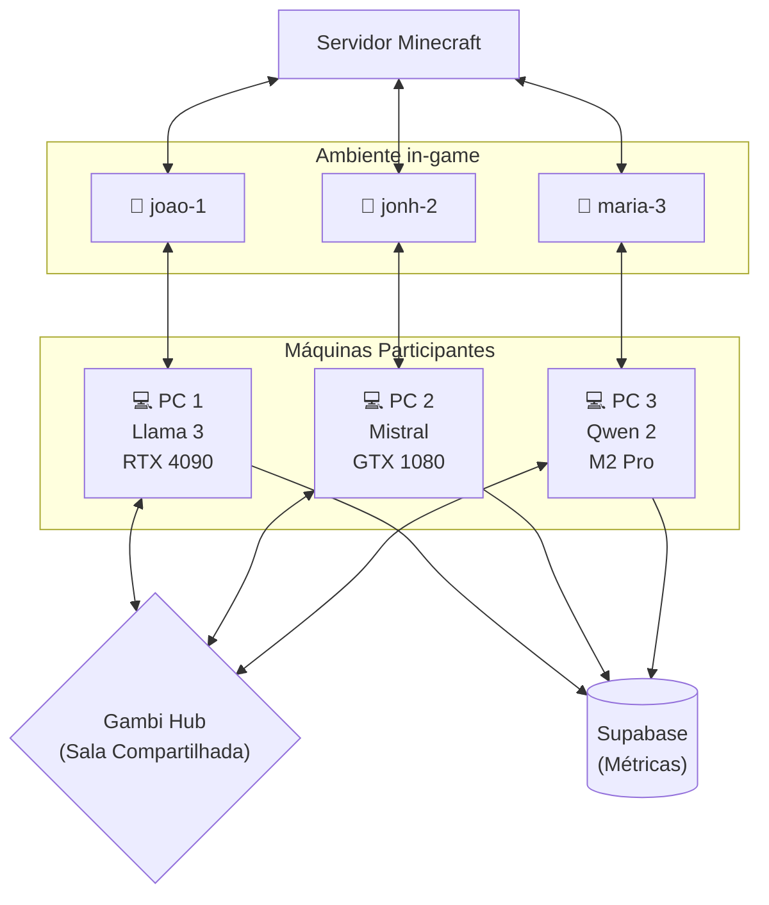

# 🤖 Minecraft Bot — Agente Autônomo (via Gambi)

Bot autônomo de Minecraft controlado por LLM. Cada participante roda sua própria instância do bot com sua própria LLM, e todos jogam no mesmo servidor. Métricas são coletadas no Supabase para análise comparativa de modelos e hardware.

## Como Funciona



Cada bot a cada ciclo (~3s):

1. **Percebe** o mundo (vida, fome, entidades, blocos, inventário)
2. **Monta o prompt** (system + contexto + memória)
3. **Envia** para sua LLM (1 participante, 1 resposta)
4. **Parseia** a resposta (JSON + validação Zod)
5. **Executa** a ação no Minecraft
6. **Loga** métricas no Supabase

## 📋 Guias do experimento

Vai rodar o experimento? Use os guias passo a passo — feitos pra copiar e colar:

- **[Guia do HOST](docs/guia-host.md)** — iniciar o gambi hub (com mDNS), criar a sala e compartilhar com todos
- **[Guia do PARTICIPANTE](docs/guia-participante.md)** — instalar e entrar com seu bot em 3 comandos
- **[Comandos do Minecraft](docs/comandos-minecraft.md)** — virar OP, teleporte, criativo e comandos úteis do experimento

## 🚀 Instalação rápida (participantes)

Não precisa clonar o repo, instalar Bun nem configurar `.env` — uma linha instala o binário pronto (com a coleta de métricas já embutida):

**Windows** (PowerShell):

```powershell
powershell -c "irm https://raw.githubusercontent.com/jvras58/bot-gambi/main/install.ps1 | iex"
```

**Linux / macOS:**

```bash
curl -fsSL https://raw.githubusercontent.com/jvras58/bot-gambi/main/install.sh | bash
```

Depois, cada participante roda só isto (com o código da sala e o IP que o host compartilhar):

```bash
# 1. Entrar na sala Gambi com sua LLM
gambi participant join --room ABC123 --model llama3.2:latest --hub http://<IP-DO-HOST>:3000

# 2. Rodar o bot
minecraft-bot --room ABC123 --hub http://<IP-DO-HOST>:3000
```

O endereço do servidor Minecraft do experimento e as credenciais do Supabase já vêm embutidos no binário — dá pra sobrescrever com `--mc-host`/`--mc-port` ou variáveis de ambiente se precisar.

> Os binários são publicados em [Releases](https://github.com/jvras58/bot-gambi/releases) pelo workflow `release.yml` a cada tag `v*`. Configure nos ajustes do repositório (secrets ou variables de Actions): `SUPABASE_URL`, `SUPABASE_ANON_KEY`, `MINECRAFT_HOST`, `MINECRAFT_PORT`, `MINECRAFT_VERSION` e `BOT_AUTH`.

As seções abaixo são para quem vai **desenvolver o bot ou hospedar o experimento** (rodar hub + servidor Minecraft).

## Pré-requisitos

* **Bun** (runtime)
* **Servidor Minecraft** Java Edition (Paper MC recomendado)
* **Gambi Hub** rodando
* **Supabase** (opcional, para coleta de dados)

Instale o Bun antes de rodar `bun install`:

**Linux / macOS:**

```bash
curl -fsSL https://bun.sh/install | bash
source ~/.zshrc
bun --version
```

Se o `bun --version` ainda falhar no zsh, abra um novo terminal ou adicione manualmente isto ao `~/.zshrc`:

```bash
export BUN_INSTALL="$HOME/.bun"
export PATH="$BUN_INSTALL/bin:$PATH"
```

**Windows** (PowerShell):

```powershell
powershell -c "irm bun.sh/install.ps1 | iex"
bun --version
```

Se o `bun --version` falhar, feche e reabra o terminal (o instalador adiciona o Bun ao PATH). O `scripts\run-local.bat` também aceita o Bun em `%USERPROFILE%\.bun\bin\bun.exe` como fallback.

## Setup

### 1. Hub Gambi + Participantes

```bash
# Terminal 1 — iniciar o hub
gambi hub serve --port 3000 --mdns

# Terminal 2 — criar sala
gambi room create --name "Experimento 1"
# → Room code: ABC123

# Cada pessoa entra na sala com sua LLM:
# PC1
gambi participant join --room ABC123 --participant-id joao-1 --model llama3.2:latest

# PC2
gambi participant join --room ABC123 --participant-id jonh-2 --model mistral --endpoint http://localhost:1234

# PC3
gambi participant join --room ABC123 --participant-id maria-3 --model qwen2

```
> Link do gambi: https://www.gambi.sh/guides/quickstart/

Use em `--model` o nome exato retornado por `ollama list`. Por exemplo, se o Ollama mostrar `llama3.2:latest`, `--model llama3` vai falhar com `Model 'llama3' not found`.

O `gambi participant join` compartilha automaticamente as specs da máquina (CPU, RAM, GPU). O `participant-id` informado será utilizado automaticamente como o nome do seu bot dentro do servidor de Minecraft.

### 2. Supabase (para coleta de dados)

```bash
# Crie um projeto em supabase.com
# No SQL Editor, execute o conteúdo de supabase/schema.sql
# Copie a URL e a anon key

```

### 3. Configure e execute

```bash
# Em CADA máquina participante:
cp .env.example .env
# Edite .env com SUPABASE_URL e SUPABASE_ANON_KEY

bun install
bun run start -- --room ABC123

```

Para rodar tudo local em um comando (hub + sala + participante + bot):

**Linux / macOS:**

```bash
bun run local -- --participant-id joao-1 --model llama3.2:latest
```

**Windows** (`bun run local` usa `bash`, que não existe por padrão no Windows — chame o `.bat` direto):

```bat
scripts\run-local.bat --participant-id joao-1 --model llama3.2:latest
```

Os dois aceitam as mesmas opções (`--participant-id`/`-p`, `--model`/`-m`, `--room`/`-r`, `--name`/`-n`, `--hub-port`, `--hub`, `--no-mdns`, `--help`/`-h`).

> 🌐 **Rodar em várias máquinas pela rede (1 hub + 1 sala compartilhada)?** Veja [docs/rodar-experimento-lan.md](docs/rodar-experimento-lan.md). Resumo: o host roda sem `--room` (cria a sala) e compartilha o código + IP; os participantes entram com `--hub http://<IP-DO-HOST>:3000 --room <CODIGO>`.

Sem `--room`, esse comando cria uma sala nova, captura automaticamente o código gerado e reaproveita o mesmo código no `gambi participant join` e no `bun run start`. Com `--room <CODIGO>`, ele entra numa sala existente em vez de criar uma.
Enquanto ele roda, o uso de RAM/VRAM e os maiores processos são gravados em `.tmp/memory.log`.
Por padrão, ele usa `LOW_MEMORY_MODE=true`, que evita cache de chunks e pathfinder para reduzir uso de RAM.

Para acompanhar em outro terminal:

```bash
# Linux / macOS
tail -f .tmp/memory.log
```

```powershell
# Windows (PowerShell)
Get-Content .tmp\memory.log -Wait
```

> No Windows, ao parar com `Ctrl+C`, responda `N` em *"Encerrar trabalho em lotes (S/N)?"* para o script encerrar o hub, o participante e o monitor sozinho. Se responder `S`, esses processos podem continuar rodando — encerre-os com `taskkill /IM gambi.exe /F`.

O bot auto-detecta qual participante usar (o que tá rodando na mesma máquina via `gambi join`) e entra no jogo com esse nome. Se tiver ambiguidade, especifique:

```bash
bun run start -- --room ABC123 --participant meu-pc

```

## CLI

```
minecraft-bot --room <ROOM_CODE> [opções]        # binário instalado
bun run start -- --room <ROOM_CODE> [opções]     # a partir do repo

Opções:
  --room, -r <code>          Código da sala Gambi (obrigatório)
  --participant, -p <name>   Nickname ou ID do participante (opcional — auto-detecta)
  --hub <url>                URL do hub (default: http://localhost:3000)
  --mc-host <host>           Host do servidor Minecraft (default: localhost)
  --mc-port <port>           Porta do servidor Minecraft (default: 25565)
  --help, -h                 Mostra ajuda

```

## Configuração

| Origem | Variável / Flag | Descrição | Default |
| --- | --- | --- | --- |
| CLI | `--room` | Código da sala | (obrigatório) |
| CLI | `--participant` | ID do participante (define o nome do bot) | (auto-detecta) |
| CLI | `--hub` | URL do hub | `http://localhost:3000` |
| CLI | `--mc-host` | Host do servidor Minecraft | `localhost` |
| CLI | `--mc-port` | Porta do servidor Minecraft | `25565` |
| .env | `SUPABASE_URL` | URL do Supabase | (embutido no binário de release) |
| .env | `SUPABASE_ANON_KEY` | Chave anônima | (embutido no binário de release) |
| .env | `MINECRAFT_HOST` | Host do servidor | `localhost` |
| .env | `MINECRAFT_PORT` | Porta do servidor | `25565` |

## Banco de Dados (Supabase)

### 3 tabelas

| Tabela | Descrição |
| --- | --- |
| `sessions` | Metadados de cada sessão (sala, bot, participante, duração) |
| `participant_snapshots` | Specs de hardware da máquina (CPU, RAM, GPU, VRAM, OS) |
| `cycle_responses` | Uma linha por ciclo — latência, ação, resultado, prompt, contexto |

### Views de análise

| View | Descrição |
| --- | --- |
| `v_latency_by_setup` | Latência média/p50/p95 por modelo × GPU |
| `v_fastest_per_cycle` | Qual setup teve menor latência em cada ciclo |

## Arquitetura

```
src/
├── index.ts                  # Bootstrap, resolve participante, inicia loop
├── config/
│   └── settings.ts           # Configurações (Gambi + Minecraft + agente)
├── bot/                      # Camada Minecraft (Mineflayer)
│   ├── ActionExecutor.ts     # Executa ações (FALAR, ANDAR, SEGUIR, etc.)
│   ├── BotManager.ts         # Conexão e eventos do bot
│   ├── MovementManager.ts    # Controle de movimento
│   └── PerceptionManager.ts  # Percepção do ambiente
├── core/                     # Lógica principal
│   ├── AgentLoop.ts          # Loop: percepção → LLM → parse → executa → log
│   ├── MemoryManager.ts      # Memória de curto prazo (ring buffer)
│   └── DataLogger.ts         # Envia métricas para Supabase
├── llm/
│   └── GambiarraLLM.ts       # Cliente LLM — invoke() para 1 participante
├── prompts/
│   └── botPrompts.ts         # System prompt + template
├── schemas/
│   └── botAction.ts          # Schema Zod das ações
├── types/
│   ├── types.ts              # Interfaces TypeScript
│   └── gambi-sdk.d.ts        # Tipos do SDK Gambi
└── utils/
    ├── args.ts               # Parser CLI
    ├── fuzzyAction.ts        # Normalização fuzzy de ações do LLM
    ├── jsonParser.ts          # Parse + reparo de JSON
    └── sleep.ts

```

## Ações Disponíveis

| Ação | Descrição |
| --- | --- |
| `FALAR` | Envia mensagem no chat |
| `ANDAR` | Move em uma direção |
| `EXPLORAR` | Movimento aleatório |
| `PULAR` | Faz o bot pular |
| `OLHAR` | Olha para jogadores próximos |
| `PARAR` | Para qualquer movimento |
| `SEGUIR` | Segue um jogador |
| `FUGIR` | Corre de uma entidade |
| `COLETAR` | Minera/coleta bloco próximo |
| `ATACAR` | Ataca entidade próxima |
| `NADA` | Apenas observa |

## Saída do Terminal

```
🤖 Minecraft Bot — Agente Autônomo

   Sala: ABC123
   Hub:  http://localhost:3000

🔍 Auto-detectado: joao-1 (llama3.2:latest)
✅ Participante: joao-1 — llama3.2:latest (GPU: NVIDIA RTX 4090, RAM: 32GB)

🧠 Agente ativado — Conectando no Minecraft como [joao-1]
📊 Session ID: a1b2c3d4-...

━━━ Ciclo #1 ━━━
✅ EXPLORAR (842ms)
💭 Estou num lugar novo, vou explorar para encontrar recursos

━━━ Ciclo #2 ━━━
✅ COLETAR (765ms)
💭 Vi madeira próxima, vou coletar para craftar ferramentas

```
