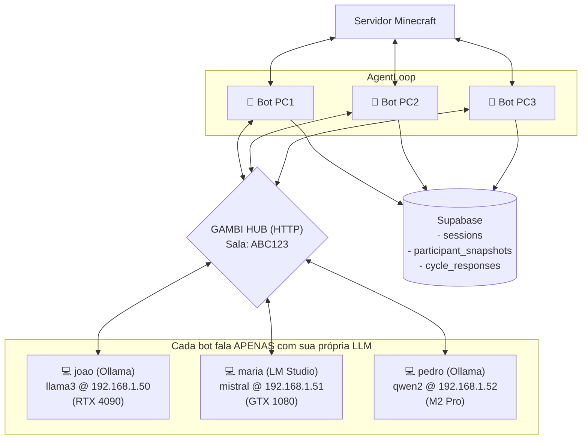
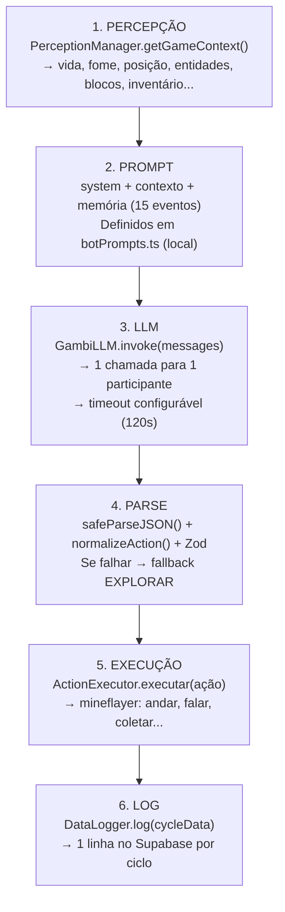
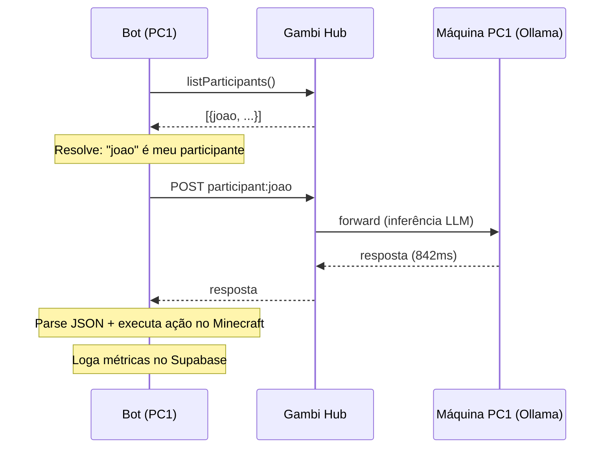
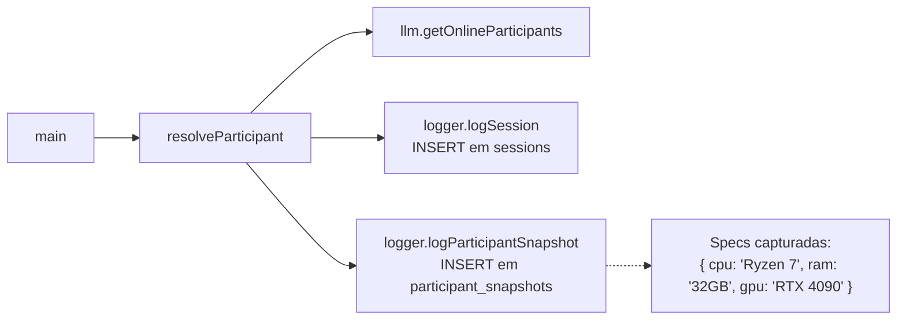
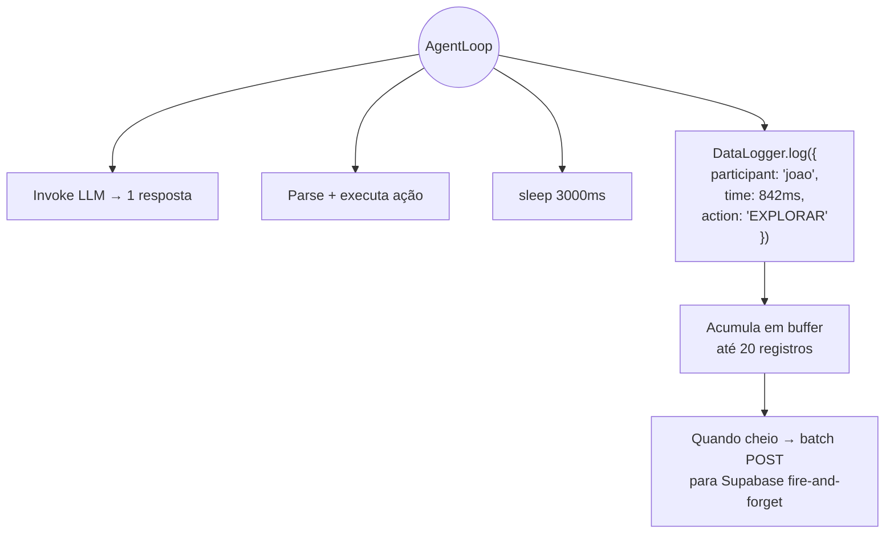

# Arquitetura — Minecraft Bot via Gambi

## Visão Geral

O projeto é um **bot autônomo de Minecraft** controlado por LLM. Cada participante roda sua própria instância: 1 bot = 1 LLM. Múltiplos bots entram no mesmo servidor Minecraft, cada um tomando decisões independentes com sua própria LLM. Métricas são coletadas no Supabase para comparação.

O bot se conecta ao **Gambi** — um hub open-source que interliga LLMs em rede local — para acessar o modelo rodando na máquina do participante.

## Componentes

### 1. Bot Minecraft (este repositório)

Aplicação TypeScript/Bun que se conecta a:

* **Servidor Minecraft** via Mineflayer (protocolo nativo)
* **Gambi Hub** via SDK (HTTP REST, API compatível com OpenAI)

O bot **não** roda nenhum LLM. Os prompts são definidos localmente em `botPrompts.ts` e enviados a cada ciclo via SDK. A inferência acontece na máquina do participante.

### 2. Gambi Hub

Servidor HTTP central que gerencia salas e redireciona requisições LLM. O hub **não** processa inferência — é um proxy transparente que:

* Mantém registro de quais máquinas estão online e quais modelos oferecem
* Redireciona requisições para o endpoint da máquina correspondente
* Retorna a resposta sem modificar o conteúdo

> Link: https://github.com/arthurbm/gambi

### 3. Supabase (Coleta de Dados)

Banco Postgres com 3 tabelas:

| Tabela | Descrição | Quando insere |
| --- | --- | --- |
| `sessions` | Metadados da sessão (room, bot, participante) | Uma vez no início |
| `participant_snapshots` | Specs da máquina (CPU, RAM, GPU, VRAM, OS) | Uma vez no início |
| `cycle_responses` | Uma linha por ciclo — latência, ação, resultado, prompt | A cada ciclo (~3s) |

Configuração opcional — sem `SUPABASE_URL` e `SUPABASE_ANON_KEY`, o bot funciona normalmente.

---

## Ciclo de Decisão (AgentLoop)

---

## Fluxo de Comunicação

---

## Pipeline de Coleta de Dados

### Início da sessão

### A cada ciclo

### O que é coletado por ciclo

| Categoria | Campos | Origem |
| --- | --- | --- |
| Sessão | `session_id`, `cycle_number`, `room_code` | AgentLoop |
| Participante | `participant_id`, `participant_nickname`, `model_name` | Startup |
| LLM | `llm_response_time_ms`, `llm_raw_length`, `llm_json_repaired`, `llm_parse_error`, `llm_error` | GambiLLM + jsonParser |
| Ação | `action`, `reasoning`, `direction`, `target`, `content`, `raw_response` | Parse |
| Execução | `action_success`, `action_execution_time_ms`, `action_error` | ActionExecutor |
| Prompt | `prompt_sent` | buildMessages() |
| Jogo | `health`, `food`, `pos_x/y/z`, `biome`, `weather`, `nearby_*`, `inventory_items` | PerceptionManager |

---

## Decisões de Design

### Por que 1 bot = 1 LLM?

Cada participante roda o bot na sua própria máquina. O bot se conecta ao Minecraft e usa a LLM local (via Gambi Hub) para tomar decisões. Isso garante que as métricas de cada LLM × hardware reflitam o desempenho real — latência inclui a inferência local, não rede entre máquinas.

### Por que Gambi Hub como intermediário?

O hub centraliza a descoberta de participantes e suas specs de hardware. Sem ele, cada bot precisaria saber o endpoint direto da LLM. Com o hub, basta entrar na sala (`gambi join`) e o bot descobre automaticamente quem é o participante local.

### Por que 3 tabelas e não 1?

* `sessions` — metadados da sessão (1 linha por execução do bot)
* `participant_snapshots` — specs de hardware, estáticas dentro de uma sessão
* `cycle_responses` — dados variáveis, 1 linha por ciclo (~3s)

### Por que Supabase?

* **Centralizado** — todos os bots logam no mesmo banco
* **Zero dependência** — é um `fetch` POST, sem drivers
* **Grátis** — free tier com 500MB
* **SQL** — queries analíticas diretas com JOINs e agregações

### Por que fire-and-forget no log?

O loop roda a cada 3s. O log não pode adicionar latência. O `DataLogger` acumula em buffer e envia em batch — se falhar, tenta no próximo flush.

### Por que salvar o prompt enviado?

O prompt muda a cada ciclo (contexto do jogo + memória são dinâmicos). Salvar permite reproduzir o experimento e analisar se determinado contexto causa mais erros em certos modelos.