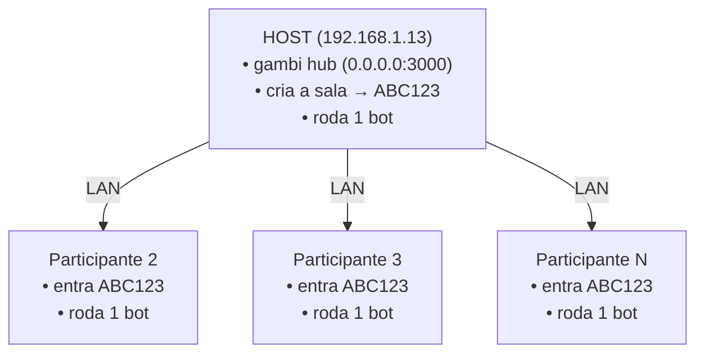

# Rodar o Experimento na LAN (Hub compartilhado)

Como rodar o bot em várias máquinas ao mesmo tempo, todas conectadas ao **mesmo hub Gambi** e à **mesma sala**, pela rede local (LAN).

A ideia: **uma** máquina é o **host** (sobe o hub e cria a sala). As outras são **participantes** e entram na sala do host pelo IP dele. Todos os bots jogam no mesmo servidor de Minecraft.



> Cada participante roda **sua própria LLM** localmente. O hub só coordena a sala; a inferência acontece em cada máquina.

---

## Pré-requisitos

**No HOST (você):**

- **Bun**, **gambi** e o repositório clonado com `bun install` feito.
  - Os scripts `run-local` instalam `gambi` e `bun` automaticamente se faltarem.
- **Servidor Minecraft** Java acessível por todos (o endereço do servidor do experimento já vem embutido no binário de release).

**Nos PARTICIPANTES** (não precisam de repo, Bun nem `.env`):

- **gambi** instalado e a LLM local rodando (ex.: Ollama).
- O binário `minecraft-bot`, instalado com uma linha:

  **Windows** (PowerShell):
  ```powershell
  powershell -c "irm https://raw.githubusercontent.com/jvras58/bot-gambi/main/install.ps1 | iex"
  ```

  **Linux / macOS:**
  ```bash
  curl -fsSL https://raw.githubusercontent.com/jvras58/bot-gambi/main/install.sh | bash
  ```

**Em todas:** mesma rede (mesmo Wi-Fi/switch).

---

## Como o hub fica acessível na LAN

O `gambi hub serve` (usado pelos scripts) **já escuta em `0.0.0.0`** por padrão — ou seja, em todas as interfaces de rede, não só `localhost`. Dá pra confirmar sem subir nada:

```bash
gambi hub serve --port 3000 --mdns --dry-run --format json
# {"host":"0.0.0.0","port":3000,"mdns":true,"bindUrl":"http://0.0.0.0:3000"}
```

`host: 0.0.0.0` significa que **outras máquinas conseguem conectar**. Para isso precisam de:

1. **O IP de LAN do host.** No host:
   - **Windows:** `ipconfig` → procure o **Endereço IPv4** da sua rede Wi-Fi/Ethernet (ex.: `192.168.1.13`). Ignore IPs de `vEthernet (WSL...)` / `172.x`.
   - **Linux/macOS:** `ip addr` ou `hostname -I` (ex.: `192.168.1.13`).
2. **A porta liberada no firewall do host.** Na primeira vez que o hub sobe escutando em `0.0.0.0`, o **Firewall do Windows** pede permissão — **permita** na rede **Privada**. Sem isso, os participantes não conectam.
   - Liberar manualmente (PowerShell como Admin, no host):
     ```powershell
     New-NetFirewallRule -DisplayName "Gambi Hub 3000" -Direction Inbound -Protocol TCP -LocalPort 3000 -Action Allow
     ```

> ⚠️ O `--mdns` anuncia o hub na LAN pra facilitar a descoberta, mas **não** substitui o IP: os participantes apontam para `http://<IP-DO-HOST>:3000`.

> ⚠️ A URL `http://localhost:3000` que aparece no terminal do host é só a forma como o **bot do próprio host** fala com o hub dele. Os **participantes remotos NÃO usam `localhost`** — usam o IP do host.

---

## Passo a passo

### 1. No HOST — sobe o hub, cria a sala e roda o bot

> O `run-local` **sempre cria uma sala nova** quando você **não** passa `--room`. Então o host roda sem `--room`.

**Windows:**
```bat
scripts\run-local.bat --participant-id joao-1 --model llama3.2:latest
```

**Linux/macOS:**
```bash
bun run local -- --participant-id joao-1 --model llama3.2:latest
```

No terminal vai aparecer algo como:
```
Iniciando hub...
Criando sala...
Sala criada: ABC123      <-- ANOTE este código e compartilhe
Entrando como participante...
Iniciando bot...
```

➡️ **Anote o código da sala (`ABC123`) e o seu IP de LAN (`192.168.1.13`)** e passe pros participantes.

### 2. Nos PARTICIPANTES — entram na sala do host

Com o binário instalado, são **dois terminais** por máquina — um pro `gambi participant join` (fica aberto, é o túnel da LLM local) e outro pro bot:

```bash
# Terminal 1 — entrar na sala do host com sua LLM (fica rodando)
gambi participant join --room ABC123 --participant-id maria-3 --model qwen2 --hub http://192.168.1.13:3000

# Terminal 2 — rodar o bot
minecraft-bot --room ABC123 --hub http://192.168.1.13:3000
```

O servidor Minecraft e a coleta de métricas (Supabase) já vêm embutidos no binário — não precisa configurar nada além do código da sala e do IP do host. Se precisar apontar pra outro servidor, use `--mc-host`/`--mc-port`.

> Importante: cada participante usa um `--participant-id` **único** (vira o nome do bot no Minecraft). Não repita IDs. E use em `--model` o nome exato retornado por `ollama list` (ex.: `llama3.2:latest`).

<details>
<summary><b>Alternativa: rodar a partir do repositório</b> (sem o binário — precisa de Bun + repo clonado)</summary>

**Windows:**
```bat
scripts\run-local.bat --participant-id maria-3 --model qwen2 --hub http://192.168.1.13:3000 --room ABC123
```

**Linux/macOS:**
```bash
bun run local -- --participant-id maria-3 --model qwen2 --hub http://192.168.1.13:3000 --room ABC123
```

Como o hub do host já está no ar, o script detecta isso (`Hub ja esta rodando em http://192.168.1.13:3000`), **não** sobe um hub local, **pula a criação da sala** (`Usando sala existente: ABC123`) e entra direto.

</details>

---

## Acompanhar uso de memória

> Só no fluxo `run-local` (a partir do repo). O binário instalado não grava esse log.

Enquanto roda, cada máquina grava RAM/VRAM e os maiores processos em `.tmp/memory.log`. Em outro terminal:

```bash
# Linux / macOS
tail -f .tmp/memory.log
```
```powershell
# Windows (PowerShell)
Get-Content .tmp\memory.log -Wait
```

---

## Encerrar

- **Participantes (binário):** `Ctrl+C` nos dois terminais (bot e `gambi participant join`).
- **Linux/macOS:** `Ctrl+C` — o script encerra hub, participante e monitor sozinho (via `trap`).
- **Windows:** `Ctrl+C` e responda **`N`** em *"Encerrar trabalho em lotes (S/N)?"* para a limpeza rodar. Se responder `S`, encerre os processos manualmente:
  ```powershell
  taskkill /IM gambi.exe /F
  ```

---

## Resumo dos comandos

| Papel | Cria sala? | Sobe hub? | Comandos |
|---|---|---|---|
| **Host** | sim (auto) | sim | `scripts\run-local.bat -p joao-1 -m llama3.2:latest` (Linux/macOS: `bun run local --`) |
| **Participante** | não (usa `--room`) | não (usa o do host) | `gambi participant join --room ABC123 --participant-id maria-3 --model qwen2 --hub http://192.168.1.13:3000` e depois `minecraft-bot --room ABC123 --hub http://192.168.1.13:3000` |

---

## Solução de problemas

| Problema | Causa provável / Solução |
|---|---|
| Participante: "hub nao respondeu em http://IP:3000" | Host não está no ar **ou** firewall do host bloqueando a porta 3000. Confira o passo do firewall. |
| Participante criou uma sala própria | Faltou `--room <CODIGO>`. Sem ele o script cria sala nova. |
| Participante conecta mas não acha a sala | Código errado/expirado. Use o código que o host gerou nessa execução (cada execução do host cria um novo). |
| `localhost` não funciona pros outros | Correto — participantes remotos usam o **IP de LAN** do host, não `localhost`. |
| Dois bots com o mesmo nome | `--participant-id` repetido. Use um ID único por máquina. |
| IP do host muda toda hora | DHCP. Considere fixar o IP do host no roteador, ou reconfirme o IP antes de cada experimento. |
